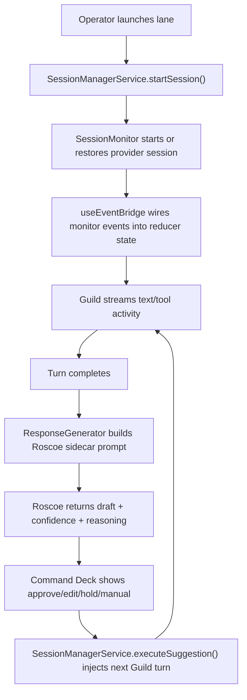

# Roscoe Architecture

This document explains how Roscoe is put together today: the major subsystems, the lane lifecycle, where state lives, and which files own which responsibilities.

## Mental model

Roscoe is a terminal control room for concurrent LLM coding lanes.

There are three distinct actors:

- The operator: the human using the TUI.
- Guild: the execution worker running inside Claude or Codex sessions.
- Roscoe: the supervisor sidecar that reads transcript context and decides the next message to send to Guild.

Roscoe is intentionally not "just another chat UI". It is an orchestration layer that:

- launches and resumes Guild lanes
- watches provider event streams
- turns raw output into a normalized transcript
- drafts the next reply with a separate sidecar prompt
- persists project defaults and lane state
- keeps onboarding, runtime governance, and live session control in one UI

## Primary modules

### App shell and state

`src/app.tsx`

- Owns the top-level reducer and screen routing.
- Holds the canonical `Map<string, SessionState>` for live lanes.
- Normalizes transcript appends and local Roscoe actions into timeline entries.
- Keeps background lanes alive even when the user is on onboarding, home, or session setup.

`src/types.ts`

- Defines the shared state model for `AppState`, `SessionState`, transcript entries, suggestion phases, and managed sessions.

### Session lifecycle and orchestration

`src/services/session-manager.ts`

- Starts or restores lanes.
- Builds the effective Guild and Roscoe runtime from project defaults plus overrides.
- Owns the execution path for sending Roscoe suggestions back into Guild.
- Generates one-line progress summaries and optional notifications.

`src/session-monitor.ts`

- Owns the long-running provider process for a Guild lane.
- Starts new turns, resumes existing conversations, parses provider stream lines, and emits normalized events.

`src/hooks/use-event-bridge.ts`

- Wires `SessionMonitor` events into app reducer actions.
- Turns streaming text, tool use, and turn completion into transcript entries and UI state.
- Triggers Roscoe suggestion generation after a Guild turn completes.
- Applies governance context, architecture principles, verification cadence, and token-efficiency guidance to Guild startup prompts.

### Roscoe drafting and runtime planning

`src/response-generator.ts`

- Builds the Roscoe sidecar prompt from project context, transcript context, saved onboarding answers, and current runtime policy.
- Reads provider transcript history when useful.
- Spawns one-shot Roscoe drafting runs.
- Parses the structured Roscoe draft payload into message text, confidence, reasoning, and optional browser/orchestrator actions.

`src/runtime-defaults.ts`

- Centralizes runtime defaults and recommendation logic.
- Decides which provider, model, reasoning effort, and execution mode should apply for Guild, Roscoe, and onboarding.
- Encodes the split between saved project defaults and live runtime recommendations.

`src/llm-runtime.ts`

- Defines the provider-agnostic runtime contract.
- Builds Claude and Codex CLI commands.
- Parses streaming lines from both protocols into a common event shape.
- Summarizes the current runtime for the TUI.

### Persistence and project memory

`src/config.ts`

- Persists project context, project history, remembered lane sessions, project registry entries, and Roscoe settings.
- Normalizes saved files into stable runtime and transcript shapes.
- Handles legacy `.llm-responder` compatibility and migration into `.roscoe`.

`src/session-transcript.ts`

- Defines transcript ordering and restore helpers.
- Reconstructs whether a restored lane is waiting on Guild or on Roscoe.
- Restores pending Roscoe drafts from persisted transcript state.

### Onboarding and runtime governance

`src/onboarder.ts`

- Runs the codebase-grounded onboarding interview.
- Requires Roscoe to capture product intent, validation expectations, delivery pillars, validation mechanism, deployment contract, architecture principles, and risk boundaries before saving the brief.

`src/components/onboarding-screen.tsx`

- Runs onboarding and refinement flows in the TUI.
- Uses the same runtime wizard component as the live `u` editor.

`src/components/runtime-controls.tsx`

- Shared Runtime & Governance wizard for onboarding and the live `u` panel.
- Edits the same saved dials regardless of when the user changes them.

### UI surfaces

`src/components/session-view.tsx`

- Main live-lane screen.
- Owns keybindings for approve/edit/hold/manual, runtime panel open/close, scrolling, and lane switching.

`src/components/session-output.tsx`

- Renders the normalized transcript or raw worker output.
- Shows Guild turns, Roscoe drafts, Roscoe sends, tool activity, and errors as a single conversation.

`src/components/suggestion-bar.tsx`

- Renders the `Command Deck`.
- This is the control point for approving, editing, holding, or overriding Roscoe's next message.

`src/components/session-list.tsx`

- Renders the left rail lane stack with one concise status line per lane.

`src/components/session-status-pane.tsx`

- Renders the top runtime/governance header for the active lane and saved project defaults.

`src/components/background-lanes-pane.tsx`

- Shows live background lane activity while the operator is elsewhere in the TUI.

## Core control flow

## Lane lifecycle in detail

### 1. Launch or restore

When the user launches a lane, Roscoe:

- resolves the canonical project root
- loads the saved project brief from `.roscoe/project.json`
- loads any remembered lane session from `.roscoe/sessions.json`
- selects the effective Guild provider/runtime and Roscoe responder runtime
- restores provider session IDs and transcript history when available

### 2. Guild execution

Guild runs as the long-lived worker conversation.

The `SessionMonitor` handles:

- provider CLI invocation
- resume semantics
- stream parsing
- tool-use events
- usage and rate-limit snapshots

The `ConversationTracker` keeps a compact context Roscoe can draft from later.

### 3. Transcript normalization

Roscoe does not render raw provider text as the main source of truth.

Instead, it stores semantic timeline entries such as:

- `remote-turn`
- `local-suggestion`
- `local-sent`
- `tool-activity`
- `error`

This is why the transcript can present Guild, Roscoe, and user interventions as one conversation even though the underlying provider streams are different.

### 4. Roscoe drafting

After a Guild turn completes:

- the bridge marks the lane as waiting
- Roscoe generates a structured draft with confidence and reasoning
- the result becomes a pending `local-suggestion`
- the `Command Deck` decides whether the draft is auto-sent, manually approved, edited, held, or replaced

### 5. Send back into Guild

When a Roscoe draft is approved or auto-sent:

- Roscoe records the sent message in the timeline
- the `InputInjector` injects the message into the existing Guild session
- the lane returns to active execution

## State model

### In-memory state

The app reducer owns:

- live lanes
- active lane selection
- screen routing
- auto/manual response mode
- transcript and output buffers

The app shell keeps this state above any individual screen so lanes continue running even when the operator moves elsewhere in the TUI.

### Persisted project state

Project-local:

- `.roscoe/project.json`
  Saved project brief, runtime defaults, and onboarding answers.
- `.roscoe/sessions.json`
  Remembered lane session state, transcript timeline, provider session IDs, summaries, and usage snapshots.

User-global:

- `~/.roscoe/projects.json`
  Registry of known projects.
- `~/.roscoe/settings.json`
  Roscoe-level settings such as SMS notification config.

Legacy compatibility:

- `.llm-responder` and `~/.llm-responder` are still read and migrated forward.

## Runtime architecture

Roscoe now has three distinct runtime surfaces:

- Onboarding runtime
  The provider/runtime Roscoe uses while reading the repo and running the interview.
- Guild runtime
  The provider/runtime future execution lanes launch with.
- Roscoe runtime
  The provider/runtime Roscoe uses when drafting replies.

These are related but no longer assumed to be identical.

Important consequences:

- Guild can run on Claude while Roscoe drafts on Codex, or the inverse.
- Runtime defaults are project-scoped, not global.
- The same runtime/governance wizard is used during onboarding and in the live `u` editor.

See `docs/runtime-governance.md` for the dial-by-dial map.

## Onboarding architecture

Onboarding is a first-class architecture input, not a one-time greeting.

Roscoe uses onboarding to save:

- product story
- definition of done
- proof expectations
- delivery pillars
- validation or coverage mechanism
- deployment contract
- non-goals and constraints
- autonomy rules
- quality bar
- architecture principles

Those saved decisions later feed:

- Guild startup prompts
- Roscoe draft prompts
- project brief UI
- refinement flows

See `docs/onboarding-interview.md` for the interview contract.

## Transcript and UI philosophy

The transcript view is supposed to feel like one organic conversation, even though several subsystems are involved.

That is why the architecture separates:

- raw stream capture
- semantic transcript entries
- command-deck control state
- left-rail lane status
- top-header runtime/governance summary

The UI is not just a mirror of the CLI streams. It is a synthesized control surface.

## Extension points

The main extension seams today are:

- add a new provider by extending `src/llm-runtime.ts` and the profile system
- add new Roscoe actions by extending the structured draft payload in `src/response-generator.ts`
- add new governance or runtime dials by extending `src/config.ts`, `src/runtime-defaults.ts`, and `src/components/runtime-controls.tsx`
- add new transcript bubble types by extending `src/types.ts` and `src/components/session-output.tsx`

## Architectural invariants

These are the assumptions the codebase is defending today:

- One lane is one continuous Guild conversation plus Roscoe supervision, not a pile of disconnected prompts.
- Guild execution and Roscoe drafting are separate responsibilities.
- Project-level intent and architecture principles are part of the runtime contract, not optional notes.
- The transcript is semantic and ordered by event time, not just by append order.
- Background lanes keep running even when the user is somewhere else in the TUI.
- Onboarding and the live runtime editor must adjust the same saved dials.
